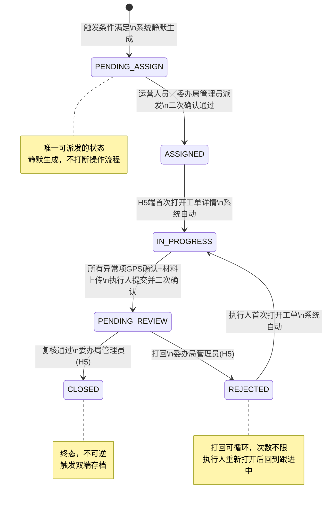
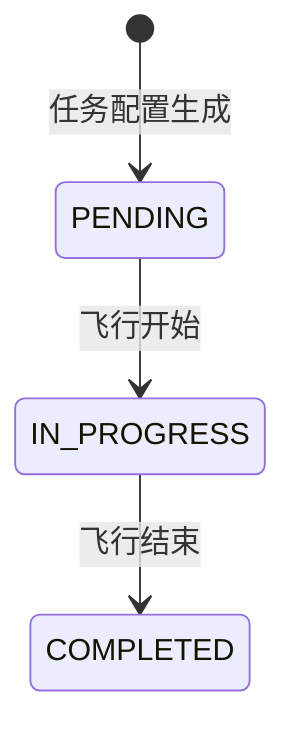

# docs/PRD.md
# 一网统飞 · 移动端应用迭代（变更20）

**版本：v2.2.0-SOP**

> 最后更新：2026-04-20
> 更新渠道：CPJ
> 变更摘要：PM评审修订——STAT-002飞行任务看板标签统一为「执行中/待执行/已完成」；HAZ/REQ新增入口确认为FAB按钮；§0.4新增状态枚举标准显示文字表；§2.0新增HAZ/REQ字段定义；§2.1/§2.2加端别标注；各功能节末尾补异常流交叉引用；原型Bug修复（HAZ-003日期筛选逻辑补全、REQ-002日期筛选控件补全）

> 本文件是移动端应用迭代（变更20）的唯一逻辑真理来源（SSOT）。

---

## 变更记录

| 版本 | 变更内容 |
|---|---|
| v2.0.0-SOP | 变更20全量输出：H5替代原委办局端；工单新增复核链路；新增REQ／HAZ／MON／STAT／NAV模块；PC新增需求池；新增委办局观察员角色；运营人员不进入H5 |
| v2.1.0-SOP | SOP合规补全：重走维度0导航审讯；新增1.4页面导航地图；重构NAV模块；0.5改为标准ASCII格式；E系列补全至E-027 |
| v2.2.0-SOP | PM评审修订：STAT-002标签统一；FAB入口确认；§0.4状态显示文字规范；§2.0数据字典整合；§2.1/§2.2端别标注；异常流交叉引用；原型Bug修复 |

---

## 第0章：业务上下文

### 0.1 核心命题

> 一网统飞以「飞行全生命周期线上化」为目标，打通运营单位与委办局之间的完整服务闭环——从委办局提出飞行需求、运营单位受理调度执飞、系统识别异常生成工单，到委办局执行人员现场处置、管理员复核归档，全程线上流转、实时可查。
>
> **委办局侧**：通过粤政易H5端，管理员可在移动端发起需求申报、派发与复核工单、监控飞行任务进度；执行人员可在现场接收工单、GPS到达确认、上传处置材料。
>
> **运营侧**：PC端新增需求池，将委办局的飞行需求申报与隐患上报统一收口，替代原有多渠道沟通模式。
>
> **渠道定位**：委办局使用H5（粤政易），运营单位使用PC；特殊场景下，运营单位可为委办局开通观察员账号，以PC只读视角支持演示与汇报。
>
> 本次变更是一网统飞服务能力向委办局侧的首次全面延伸。

### 0.2 各方职责边界

| 主体 | 系统内职责 | 系统外职责 |
|---|---|---|
| 运营单位 | PC端：全局工单生命周期管理；需求池处理；委办局观察员账号创建 | 与委办局签署服务协议；系统外确认飞行需求 |
| 委办局管理员 | H5端：工单派发／复核／任务监控／数据统计／需求申报／隐患上报与隐患池／用户管理 | 组织人员赴现场核实 |
| 委办局执行人员 | H5端：工单接收／GPS围栏确认／现场材料上传／隐患上报 | 赴现场核实；实际解决问题 |
| 委办局观察员 | PC端：全模块只读·本局数据（用户管理／算法管理除外） | 汇报场景使用 |
| 系统 | 全量归档飞行数据；结构化异常线索；管理工单生命周期；双端存档处置记录 | — |

### 0.3 角色定义与数据权限

| 组织 | 角色 | 渠道 | 核心职责 | 数据可见范围 |
|---|---|---|---|---|
| 运营单位 | 运营人员 | PC | 全局管理；需求池处理；观察员账号创建 | 全量数据 |
| 委办局 | 管理员 | H5 | 工单派发／复核；需求申报；隐患池；用户管理 | 本局全量数据 |
| 委办局 | 执行人员 | H5 | 工单现场执行；隐患上报 | 指派给自己的工单 |
| 委办局 | 观察员 | PC | 只读查看（汇报场景） | 本局数据·全只读 |

### 0.4 术语规范（禁止混用）

| 术语 | 定义 | 禁止混用词 |
|---|---|---|
| 任务 | 委办局委托运营单位执行的巡检任务配置，分单次／周期两种类型 | 工单、项目 |
| 架次 | 任务的一次实际执行单元（子任务） | 任务、飞行记录 |
| 静默生成 | 系统后台自动完成创建，不弹窗、不打断操作、不需用户确认 | 自动生成、后台生成 |
| 联动动作 | 状态流转时系统自动执行的写入或通知操作 | 副作用 |
| 线下核实与处置 | 委办局执行人员赴现场核实并实际解决问题，发生在系统外 | 复核、线上复核 |
| 异常线索 | 经确认标注后的异常素材集合，是工单的来源 | 异常数据、问题数据 |

#### 状态枚举值标准显示文字（跨模块统一）

> 同一 status 枚举值在所有页面、看板、标签中的中文显示文字须严格一致，不得混用。

| 模块 | 枚举值 | 标准显示文字 |
|---|---|---|
| 飞行架次 | `IN_PROGRESS` | 执行中 |
| 飞行架次 | `PENDING` | 待执行 |
| 飞行架次 | `COMPLETED` | 已完成 |
| 工单 | `PENDING_ASSIGN` | 待指派 |
| 工单 | `ASSIGNED` | 已指派 |
| 工单 | `IN_PROGRESS` | 跟进中 |
| 工单 | `PENDING_REVIEW` | 待复核 |
| 工单 | `REJECTED` | 已打回 |
| 工单 | `CLOSED` | 已完成 |
| 需求申报 | `SUBMITTED` | 已提交 |
| 需求申报 | `PROCESSING` | 处理中 |
| 需求申报 | `RESOLVED` | 已完成 |
| 需求申报 | `REJECTED` | 已驳回 |
| 隐患 | `ACTIVE` | （无需显示状态文字） |
| 隐患 | `DELETED` | 已删除 |

### 0.5 整体业务流程

```
┌─────────────────────────────────────┐
│ 1. 需求申报                          │
│    参与方：委办局管理员               │
│    渠道：H5 · 需求申报               │
│    输出：需求申报记录                 │
└──────────────────┬──────────────────┘
                   │
                   ▼
┌─────────────────────────────────────┐
│ 2. 需求处理                          │
│    参与方：运营人员                   │
│    渠道：PC · 需求池（申报Tab）       │
│    输出：申报状态更新                 │
└──────────────────┬──────────────────┘
                   │
                   ▼
┌─────────────────────────────────────┐
│ 3. 任务定义                          │
│    参与方：运营单位                   │
│    渠道：PC · 任务调度               │
│    输出：任务配置                     │
└──────────────────┬──────────────────┘
                   │
                   ▼
┌─────────────────────────────────────┐
│ 4. 飞行调度                          │
│    参与方：运营单位                   │
│    渠道：PC · 指挥中心               │
│    输出：架次记录                     │
└──────────────────┬──────────────────┘
                   │
                   ▼
┌─────────────────────────────────────┐
│ 5. 数据回传归档                       │
│    参与方：系统自动                   │
│    渠道：系统后台                     │
│    输出：原始飞行数据                 │
└──────────────────┬──────────────────┘
                   │
                   ▼
┌─────────────────────────────────────┐
│ 6. 线索识别确认                       │
│    参与方：运营单位（数据处理）        │
│    渠道：PC · 成果管理               │
│    输出：异常线索素材列表             │
└──────────────────┬──────────────────┘
                   │
                   ├─ 有确认异常 ──▶ 继续
                   └─ 无确认异常 ──▶ 归档结束
                   │
                   ▼
┌─────────────────────────────────────┐
│ 7. 工单派发                          │
│    参与方：运营人员／委办局管理员      │
│    渠道：PC · 工单管理／H5 · 工单Tab │
│    输出：工单（ASSIGNED）             │
└──────────────────┬──────────────────┘
                   │
                   ▼
┌─────────────────────────────────────┐
│ 8. 现场执行                          │
│    参与方：委办局执行人员             │
│    渠道：H5 · 工单Tab               │
│    输出：工单（PENDING_REVIEW）       │
└──────────────────┬──────────────────┘
                   │
                   ▼
┌─────────────────────────────────────┐
│ 9. 工单复核                          │
│    参与方：委办局管理员               │
│    渠道：H5 · 工单Tab               │
│    输出：工单（CLOSED／REJECTED）     │
└──────────────────┬──────────────────┘
                   │
                   ├─ 复核通过 ──▶ 双端存档·终态
                   └─ 打回 ──▶ 回到阶段8循环

── 独立链路（与主流程无依赖，随时可触发）────────────────

┌─────────────────────────────────────┐
│ 10. 隐患反馈                         │
│     参与方：委办局执行人员／管理员    │
│     渠道：H5 · 隐患上报             │
│     输出：隐患记录→隐患池            │
└──────────────────┬──────────────────┘
                   │
                   ▼
┌─────────────────────────────────────┐
│ 11. 隐患处理                         │
│     参与方：运营人员                  │
│     渠道：PC · 需求池（隐患Tab）     │
│     输出：隐患备注／软删除            │
└─────────────────────────────────────┘
```

### 0.6 数据模型关联关系

```
需求申报(REQ) ──────────────────────────────────────> 任务配置
                                                         │
任务 ──1:N──> 架次（子任务） ──1:N──> 素材 ──N:1──> 工单
                                                    ↕（双向可查）
                                                   架次
隐患(HAZ) ──独立链路──> 隐患池（运营人员查看）
```

### 0.7 全站架构图

本图描述**渠道、角色入口与业务模块之间的结构关系**，与 §0.5「整体业务流程」互为补充：§0.5 回答主链路**按时间顺序**经过哪些阶段；本图回答系统由**哪些能力模块组成**、各角色经**各端登录页**完成身份校验后，进入**哪一侧渠道**再使用哪些能力。图中「运营侧其它电脑端能力」为全产品能力示意，是否纳入本期开发与交付以项目范围为准；仿真原型所覆盖页面子集以实际交付为准，**不以本图或 §0.5 单独作为页面实现清单**。账号密码登录、用户管理等功能名称与章节对应关系见第1章「账号认证」及第2章各节（文中功能编号仅便于与章内条目对照，**阅读本图以中文能力名为准**）。

```
                         ┌────────────────────┐           ┌────────────────────┐
                         │ 移动端登录页        │           │ 电脑端登录页        │
                         │ h5/login.html      │           │ pc/login.html      │
                         │ 账号密码登录        │           │ 运营／观察员账号    │
                         └─────────┬──────────┘           └─────────┬──────────┘
                                   │ 建立会话                         │ 建立会话
                                   ▼                                  ▼
┌──────────────────────────────────────────────────────┐  ┌──────────────────────────────────────────────────────┐
│ 移动端渠道（粤政易内核）                              │  │ 电脑端网页                                           │
│ 角色：委办局管理员、委办局执行人员                    │  │ 角色：运营人员、委办局观察员（本局数据只读）           │
├──────────────────────────────────────────────────────┤  ├──────────────────────────────────────────────────────┤
│ · 底部导航与首页、首页数据看板                       │  │ · 工单列表与工单详情（全生命周期）                   │
│ · 飞行需求申报、隐患上报与隐患列表                   │  │ · 需求池：「飞行需求申报」「隐患上报」两个主栏       │
│ · 任务与架次（监控）、工单填报与复核等               │  │   申报栏对接需求申报；隐患栏对接隐患池               │
│ 页面跳转见 §1.4；细则见 §2.2                         │  │ 观察员只读规则见第2章需求池相关节                   │
│ 执行人员无「任务」底部入口，见该章导航规格           │  │                                                      │
└──────────────────────────┬───────────────────────────┘  └──────────────────────────┬───────────────────────────┘
                           │                                                            │
                           └────────────────────────────┬───────────────────────────────┘
                                                        ▼
                                              ┌─────────────────────┐
                                              │ 核心业务数据对象     │
                                              │ 任务配置·架次·素材   │
                                              │ 工单·需求申报·隐患   │
                                              └─────────────────────┘
                                                        ▲
                           ┌────────────────────────────┴────────────────────────────┐
                           │ 运营侧其它电脑端能力（产品级示意；是否本期交付以项目为准）│
                           │ 任务调度 · 指挥中心 · 成果管理 → 写入或关联上表对象   │
                           └─────────────────────────────────────────────────────────┘
```

---

## 第1章：功能清单

### 1.1 WBS功能树

```
移动端应用（H5迭代）
│
├── [NAV] 主页与导航
│   ├── NAV-001 [H5] 底部导航栏
│   └── NAV-002 [H5] 首页结构（数据看板区+功能入口区）
│
├── [AUTH] 账号认证
│   ├── AUTH-001 [H5] 账号密码登录
│   └── AUTH-002 [H5] 用户管理（委办局管理员管理本局账号）
│
├── [WO] 工单模块
│   ├── WO-004 [PC] 工单列表页（Tab形式·全生命周期）
│   ├── WO-005 [PC] 详情页·基础信息区
│   ├── WO-006 [PC] 详情页·派发操作区（过渡期）
│   ├── WO-007 [PC] 详情页·异常线索区
│   ├── WO-008 [PC] 详情页·处置记录时间线
│   ├── WO-009 [H5] 工单Tab·统计子Tab
│   ├── WO-010 [H5] 工单Tab·管理子Tab（列表+详情）
│   ├── WO-011 [H5] GPS围栏自动确认
│   ├── WO-012 [H5] 现场材料上传
│   ├── WO-013 [H5] 工单派发
│   └── WO-014 [H5/PC] 工单复核
│
├── [HAZ] 隐患模块
│   ├── HAZ-001 [H5] 隐患上报表单（执行人员／管理员）
│   ├── HAZ-002 [通用] 隐患数据模型
│   ├── HAZ-003 [H5] 隐患列表（管理员+执行人员）
│   ├── HAZ-004 [H5] 隐患详情与管理操作
│   └── HAZ-005 [PC] 需求池·隐患Tab（运营人员）
│
├── [REQ] 飞行需求申报
│   ├── REQ-001 [H5] 需求申报表单（委办局管理员）
│   ├── REQ-002 [H5] 申报记录列表（委办局管理员）
│   └── REQ-003 [PC] 需求池·申报Tab（运营人员）
│
├── [MON] 任务监控与视频
│   ├── MON-001 [H5] 任务Tab·架次列表（执行中／待执行／已完成）
│   ├── MON-002 [H5] 架次详情页
│   ├── MON-003 [H5] 实时视频页（从执行中架次详情进入）
│   ├── MON-004 [H5] 视频回放页（从已完成架次详情进入）
│   └── MON-005 [H5] 航迹页（Cesium，三种状态均可进入）
│
└── [STAT] 数据统计
    ├── STAT-002 [H5] 飞行任务统计（首页数据看板）
    ├── STAT-003 [H5] 飞行成果统计（首页数据看板）
    └── STAT-004 [H5] 工单管理统计（首页数据看板+工单统计Tab）
```

### 1.2 MVP范围声明

**包含：**
- H5全量7模块交付，完整替代原委办局H5端
- PC端新增需求池（REQ-003／HAZ-005）
- PC端工单列表Tab化（WO-004）
- 委办局观察员角色（PC只读）
- AUTH-002 H5用户管理
- 首页数据看板（STAT-002/003/004直接展示，今日／累计联动切换）
- 工单Tab拆分统计／管理两个子Tab
- 任务Tab拆分执行中／待执行／已完成三个子Tab

**明确排除：**
- 粤政易（粤政易移动办公平台）统一身份认证（D-09）
- H5离线缓存（D-02）
- 超时推送通知（D-05）
- 隐患关联飞行需求创建任务链路
- STAT-001飞行资产统计（委办局无飞行资产，废弃）
- WO-006 PC派发操作长期保留（过渡期后移交H5，列附录D）

### 1.3 权限控制矩阵

#### H5端权限

| 操作 | 委办局管理员 | 委办局执行人员 |
|---|:---:|:---:|
| H5查看工单列表 | ✓（本局） | ✓（仅自己） |
| H5工单派发 | ✓（本局） | — |
| H5工单复核 | ✓（本局） | — |
| H5提交现场确认 | ✓ | ✓（仅自己） |
| H5查看隐患列表 | ✓（本局全部） | ✓（仅自己） |
| H5隐患上报 | ✓ | ✓ |
| H5隐患备注／删除 | ✓ | ✓ |
| H5需求申报 | ✓（本局） | — |
| H5任务监控 | ✓（本局） | — |
| H5数据统计（首页看板） | ✓（本局） | ✓（工单相关） |
| H5用户管理 | ✓（本局） | — |
| H5修改密码／手机号 | ✓ | ✓ |

#### PC端权限

| 操作 | 运营人员 | 委办局观察员 |
|---|:---:|:---:|
| PC查看工单列表／详情 | ✓（全量） | ✓（本局·只读） |
| PC工单派发（过渡期） | ✓ | — |
| PC工单复核 | ✓ | — |
| PC需求池（申报Tab） | ✓ | ✓（只读） |
| PC需求池（隐患Tab） | ✓ | ✓（只读） |
| PC指挥中心 | ✓ | ✓（本局·只读） |
| PC空域服务 | ✓ | ✓（本局·只读） |
| PC航线管理 | ✓ | ✓（本局·只读） |
| PC任务调度 | ✓ | ✓（本局·只读） |
| PC直播中心 | ✓ | ✓（本局·只读） |
| PC成果管理 | ✓ | ✓（本局·只读） |
| PC资产管理 | ✓ | ✓（本局·只读） |
| PC用户管理 | ✓ | — |
| PC算法管理 | ✓ | — |

**关键权限规则：**
- 运营人员派发时，指派对象必须是该工单归属委办局的人员，不可跨局
- 委办局管理员只可查看／操作本局数据，不可跨局
- 委办局无子部门概念，按委办局维度隔离
- 委办局观察员账号由运营人员在PC端创建，线下交付账号密码

### 1.4 页面导航地图

```
┌─────────────────────────────────────────────────────────────┐
│ H5端页面地图                                                  │
│                                                             │
│ login.html            登录                                   │
│   └─ replace ──▶ home.html           首页（默认落地）         │
│                                                             │
│ 底部导航Tab                                                   │
│   ├─ Tab1 首页（home.html）                                   │
│   ├─ Tab2 工单（workorder.html）                              │
│   ├─ Tab3 任务（task.html，仅委办局管理员）                    │
│   └─ Tab4 我的（mine.html）                                   │
│   （委办局执行人员仅三项：首页／工单／我的，无「任务」；不与上表 Tab1～Tab4 序号混用）│
│                                                             │
│ ── Tab1 首页 ──────────────────────────────────────────────  │
│   home.html                                                 │
│   ├─ push ──▶ hazard.html            隐患列表                 │
│   │             ├─ push ──▶ hazard_detail.html   隐患详情     │
│   │             └─ push ──▶ hazard_form.html     新增隐患     │
│   └─ push ──▶ request.html           需求申报列表（仅管理员）  │
│                 ├─ push ──▶ request_detail.html  申报详情     │
│                 └─ push ──▶ request_form.html    新增申报     │
│                                                             │
│ ── Tab2 工单 ──────────────────────────────────────────────  │
│   workorder.html                                            │
│   ├─ [统计子Tab] 点击状态卡片 ──▶ 切换至管理子Tab+带入筛选     │
│   └─ [管理子Tab]                                             │
│         └─ push ──▶ workorder_detail.html  工单详情          │
│                       ├─ modal ──▶ 派发操作（仅管理员）       │
│                       ├─ modal ──▶ 复核操作（仅管理员）       │
│                       └─ GPS确认+上传+提交（执行人员）        │
│                                                             │
│ ── Tab3 任务 ──────────────────────────────────────────────  │
│   task.html                                                 │
│   ├─ [执行中子Tab]                                           │
│   │    └─ push ──▶ task_detail.html       架次详情           │
│   │                 ├─ push ──▶ track.html    航迹页（Cesium）│
│   │                 └─ push ──▶ video_live.html 实时视频     │
│   ├─ [待执行子Tab]                                           │
│   │    └─ push ──▶ task_detail.html       架次详情           │
│   │                 └─ push ──▶ track.html    航迹页（仅规划）│
│   └─ [已完成子Tab]                                           │
│        └─ push ──▶ task_detail.html       架次详情           │
│                     ├─ push ──▶ track.html    航迹页（叠加）  │
│                     └─ push ──▶ video_replay.html 视频回放   │
│                                                             │
│ ── Tab4 我的 ──────────────────────────────────────────────  │
│   mine.html                                                 │
│   ├─ push ──▶ user_mgmt.html         用户管理（仅管理员）     │
│   ├─ push ──▶ change_pwd.html        修改密码                │
│   ├─ push ──▶ change_phone.html      修改手机号              │
│   └─ replace ──▶ login.html          退出登录                │
└─────────────────────────────────────────────────────────────┘
```

---

## 第2章：逻辑规格

---

### §2.0 全局规格

#### 触发规格

工单静默生成触发条件：
- 线索识别确认完成
- `anomaly_media_ids` 中至少1个 `label=CONFIRMED` 的素材
- 上游触发信号字段完整（`dept_id`、`flight_id`、`station_addr`、`anomaly_media_ids`）

不满足以上任一条件：工单不生成，走归档结束路径，写错误日志。

#### 状态标签颜色速查表

> 以下色值均为建议值，实际以 UI 设计师出图为准。

| 状态枚举值 | 显示文字 | 建议色值 |
|---|---|---|
| PENDING_ASSIGN | 待指派 | #FA8C16 |
| ASSIGNED | 已指派 | #1677FF |
| IN_PROGRESS | 跟进中 | #1677FF |
| PENDING_REVIEW | 待复核 | #722ED1 |
| REJECTED（工单） | 已打回 | #F5222D |
| CLOSED | 已完成 | #52C41A |
| SUBMITTED | 已提交 | #1677FF |
| PROCESSING | 处理中 | #1677FF |
| RESOLVED | 已完成（申报） | #52C41A |
| REJECTED（申报） | 已驳回 | #F5222D |
| ACTIVE（隐患） | — | #52C41A |
| DELETED（隐患） | — | #8C8C8C |

#### 全局数据字典

##### 工单主体字段（WO-002）

| 字段名 | 类型 | 来源 | 约束 | 说明 |
|---|---|---|---|---|
| `id` | String | 系统生成 | 唯一；`WO-YYYY-MMDD-NNN` | 工单编号 |
| `dept_id` | Ref→Dept | 上游触发 | 必填；不可修改 | 归属委办局 |
| `flight_id` | Ref→Flight | 上游触发 | 必填；不可修改 | 来源架次 |
| `station_addr` | String | 任务配置继承 | 必填；不可修改 | 任务站点位置 |
| `anomaly_media_ids` | Ref[]→Media | 上游触发 | 至少1个；仅`label=CONFIRMED` | 关联确认异常素材 |
| `status` | Enum | 流转更新 | 见工单状态机 | 当前状态 |
| `assignee_id` | Ref→User\|null | 派发写入 | 仅`PENDING_ASSIGN`时可写 | 指派执行人 |
| `dispatch_note` | String\|null | 派发写入 | 选填；max 200字 | 派发备注 |
| `dispatched_at` | Timestamp\|null | 流转写入 | 状态→`ASSIGNED`时写入 | 指派时间 |
| `viewed_at` | Timestamp\|null | 流转写入 | H5首次打开时写入 | 执行人查看时间 |
| `submitted_at` | Timestamp\|null | 流转写入 | 状态→`PENDING_REVIEW`时写入 | 执行人提交时间 |
| `reviewed_by` | Ref→User\|null | 流转写入 | 复核操作人 | 复核人ID |
| `reviewed_at` | Timestamp\|null | 流转写入 | 状态→`CLOSED`时写入 | 复核通过时间 |
| `rejected_at` | Timestamp\|null | 流转写入 | 状态→`REJECTED`时写入 | 打回时间 |
| `reject_note` | String\|null | 复核人填写 | 选填；max 200字 | 打回原因 |
| `reopened_at` | Timestamp\|null | 流转写入 | 从`REJECTED`转`IN_PROGRESS`时写入 | 重新跟进时间 |
| `closed_at` | Timestamp\|null | 流转写入 | 状态→`CLOSED`时写入 | 关闭时间 |
| `created_at` | Timestamp | 系统生成 | 不可修改 | 工单创建时间 |

##### anomaly_media扩展字段（每项独立）

| 字段名 | 类型 | 来源 | 约束 | 说明 |
|---|---|---|---|---|
| `anomaly_addr` | String | 素材坐标反解 | 必填 | 异常地点 |
| `gps_lat` | Float\|null | GPS自动写入 | 范围-90~90 | 该异常点确认纬度 |
| `gps_lng` | Float\|null | GPS自动写入 | 范围-180~180 | 该异常点确认经度 |
| `gps_confirmed_at` | Timestamp\|null | GPS自动写入 | 进入围栏即写入；一次性 | 该异常点GPS确认时间 |
| `site_photos` | File[] | H5分项提交 | GPS确认后必填；至少1张 | 该异常点现场照片 |
| `site_note` | String\|null | H5分项提交 | 选填；max 500字 | 该异常点现场说明 |

##### 隐患主体字段（HAZ-002）

| 字段名 | 类型 | 来源 | 约束 | 说明 |
|---|---|---|---|---|
| `id` | String | 系统生成 | 唯一；`HAZ-YYYY-MMDD-NNN` | 隐患编号 |
| `reporter_id` | Ref→User | 当前登录用户 | 必填；不可修改 | 上报人 |
| `dept_id` | Ref→Dept | 从`reporter_id`继承 | 必填；自动填入；不可修改 | 归属委办局 |
| `type` | Enum | 表单提交 | 必填；六选一 | 隐患类型 |
| `photos` | File[] | 表单提交 | 必填；至少1张 | 现场照片 |
| `gps_lat` | Float\|null | GPS自动获取 | 范围-90~90；未授权时null | 上报纬度 |
| `gps_lng` | Float\|null | GPS自动获取 | 范围-180~180；未授权时null | 上报经度 |
| `description` | String\|null | 表单提交 | 选填；max 200字 | 隐患描述 |
| `status` | Enum | 系统／操作人 | `ACTIVE`\|`DELETED` | 隐患状态 |
| `note` | String\|null | 操作人填写 | 选填；max 200字；单次覆盖 | 备注（管理员+执行人均可） |
| `deleted_at` | Timestamp\|null | 操作人操作 | 软删除时写入 | 删除时间 |
| `created_at` | Timestamp | 系统生成 | 不可修改 | 上报时间 |

**关键决策：** 隐患无状态流转，MVP只有`ACTIVE`／`DELETED`；备注单次覆盖；删除为软删除不可逆；备注和删除权限：管理员+执行人员均可。

##### 需求申报主体字段（REQ-002）

| 字段名 | 类型 | 来源 | 约束 | 说明 |
|---|---|---|---|---|
| `id` | String | 系统生成 | 唯一；`REQ-YYYY-MMDD-NNN` | 申报编号 |
| `dept_id` | Ref→Dept | 当前登录用户继承 | 必填；不可修改 | 归属委办局 |
| `applicant_id` | Ref→User | 当前登录用户 | 必填；不可修改 | 申报人 |
| `station_id` | Ref→Station | 表单提交 | 必填 | 飞行区域站点 |
| `task_desc` | String | 表单提交 | 必填；max 500字 | 任务描述 |
| `time_desc` | String | 表单提交 | 必填；max 200字 | 任务时间描述 |
| `deliverable_desc` | String | 表单提交 | 必填；max 500字 | 成果要求 |
| `status` | Enum | 流转更新 | `SUBMITTED`\|`PROCESSING`\|`RESOLVED`\|`REJECTED` | 申报状态 |
| `accepted_at` | Timestamp\|null | 流转写入 | 受理时写入 | 受理时间 |
| `rejected_at` | Timestamp\|null | 流转写入 | 驳回时写入 | 驳回时间 |
| `reject_note` | String\|null | 运营人员填写 | 选填；max 200字 | 驳回原因 |
| `linked_task_id` | Ref→Task\|null | 运营人员回填 | 选填 | 关联任务ID |
| `resolved_desc` | String\|null | 运营人员回填 | 选填；max 500字 | 完成说明 |
| `resolved_at` | Timestamp\|null | 流转写入 | 已完成时写入 | 完成时间 |
| `created_at` | Timestamp | 系统生成 | 不可修改 | 申报时间 |

#### 工单状态机

##### Mermaid版本



##### ASCII版本

```
  识别完成 + ≥1张确认异常
  系统静默生成
          │
          ▼
  ┌──────────────────┐
  │  待指派           │  ← 唯一可发起派发的状态
  │  PENDING_ASSIGN  │
  └──────────────────┘
          │  派发 + 二次确认
          │  触发方：运营人员(PC) / 委办局管理员(H5)
          ▼
  ┌──────────────────┐
  │  已指派           │
  │  ASSIGNED        │
  └──────────────────┘
          │  H5首次打开工单详情
          │  触发方：系统自动，写viewed_at
          ▼
  ┌──────────────────┐
  │  跟进中           │  ← 不可重新指派
  │  IN_PROGRESS     │
  └──────────────────┘
          │  所有anomaly_media项均满足：
          │    gps_confirmed_at非空 AND site_photos≥1张
          │  + 执行人点击提交并二次确认
          ▼
  ┌──────────────────┐
  │  待复核           │
  │  PENDING_REVIEW  │
  └──────────────────┘
          │
          ├─ 复核通过 ──────────────────────────┐
          │  触发方：委办局管理员(H5)              │
          │                                      ▼
          │                          ┌──────────────────┐
          │                          │  已完成           │
          │                          │  CLOSED          │  → 双端存档
          │                          │  终态·不可逆      │
          │                          └──────────────────┘
          │
          └─ 打回 ──────────────────────────────┐
             触发方：委办局管理员(H5)              │
                                                 ▼
                                     ┌──────────────────┐
                                     │  已打回           │
                                     │  REJECTED        │
                                     └──────────────────┘
                                               │  执行人首次打开工单
                                               │  触发方：系统自动
                                               ▼
                                          回到跟进中
                                          IN_PROGRESS
                                          （循环，打回次数不限）

  ⚠️  无退回路径（CLOSED终态不可逆）
  ⚠️  打回可循环，次数不限
  ⚠️  GPS围栏和材料上传以每条anomaly_media为单位
```

##### 状态流转表

| 当前状态 | 事件 | 流转至 | 触发方 | 联动动作 |
|---|---|---|---|---|
| 初始 | 触发条件满足 | 待指派（PENDING_ASSIGN） | 系统自动 | 静默生成，写`created_at` |
| 待指派（PENDING_ASSIGN） | 派发+二次确认 | 已指派（ASSIGNED） | 运营人员(PC)／委办局管理员(H5) | 写`assignee_id`、`dispatched_at`；推送H5通知 |
| 已指派（ASSIGNED） | H5首次打开详情 | 跟进中（IN_PROGRESS） | 系统自动 | 写`viewed_at` |
| 跟进中（IN_PROGRESS） | 所有异常项满足条件，执行人提交并二次确认 | 待复核（PENDING_REVIEW） | 执行人触发 | 写各异常项`gps_*`、`site_*`；写`submitted_at` |
| 待复核（PENDING_REVIEW） | 复核通过 | 已完成（CLOSED） | 委办局管理员(H5) | 写`closed_at`；触发双端存档；写`reviewed_by`、`reviewed_at` |
| 待复核（PENDING_REVIEW） | 打回 | 已打回（REJECTED） | 委办局管理员(H5) | 写`rejected_at`、`reject_note`（选填） |
| 已打回（REJECTED） | 执行人首次打开工单 | 跟进中（IN_PROGRESS） | 系统自动 | 写`reopened_at` |

---

### §2.1 PC端功能规格 ▎电脑端渠道 · 运营人员 / 委办局观察员

#### [WO-004] PC端工单列表页 [PC]

> Tab形式呈现全生命周期工单，Tab标签附带当日状态数量。

##### 页面结构

```
┌──────────────────────────────────────────────────────────┐
│  [全部(73)][待指派(12)][已指派(5)][跟进中(8)]             │
│  [待复核(3)][已打回(1)][已完成(47)]                       │  ← Tab导航（附带数量）
├──────────────────────────────────────────────────────────┤
│  [日期选择器]  [关键词输入]  [归属委办局下拉]               │
│                              [查询]  [重置]               │
├──────────────────────────────────────────────────────────┤
│  [ 卡片 ]  [ 卡片 ]  [ 卡片 ]  [ 卡片 ]   ← 4列网格      │
│  （无限滚动）                                              │
└──────────────────────────────────────────────────────────┘
```

##### Tab数量规则

| Tab | 计算逻辑 |
|---|---|
| 全部(N) | `COUNT WHERE DATE(created_at)=selected` |
| 待指派(N) | `COUNT WHERE status=PENDING_ASSIGN AND DATE(created_at)=selected` |
| 已指派(N) | `COUNT WHERE status=ASSIGNED AND DATE(created_at)=selected` |
| 跟进中(N) | `COUNT WHERE status=IN_PROGRESS AND DATE(created_at)=selected` |
| 待复核(N) | `COUNT WHERE status=PENDING_REVIEW AND DATE(created_at)=selected` |
| 已打回(N) | `COUNT WHERE status=REJECTED AND DATE(created_at)=selected` |
| 已完成(N) | `COUNT WHERE status=CLOSED AND DATE(created_at)=selected` |

##### 筛选区

| 筛选项 | 控件 | 筛选字段 |
|---|---|---|
| 日期 | 单日期选择器（默认当天） | `DATE(created_at)` |
| 关键词 | 文本输入 | `id`／`task_name`模糊搜索 |
| 归属委办局 | 下拉单选 | `dept_id` |

重置：清空关键词／委办局，日期恢复当天，Tab回到「全部」。

**角色差异说明：**

观察员数据隔离：「归属委办局」筛选项固定为授权局，不可修改，重置不清空此项；运营人员可自由选择全部或某局。

---

#### [WO-005] PC端详情页·基础信息区 [PC]

| 序 | 字段标签 | 来源字段 | 显示规则 |
|---|---|---|---|
| 1 | 工单编号 | `id` | 纯展示 |
| 2 | 生成时间 | `created_at` | 格式化展示 |
| 3 | 归属委办局 | `dept_id`（解析为委办局名称） | 纯展示 |
| 4 | 任务名称 | `task_name` | 通过`flight_id`关联；链接样式，点击跳转成果管理详情页 |
| 5 | 当前状态 | `status` | 状态标签，颜色见本文§2.0状态标签颜色速查表 |
| 6 | 指派对象 | `assignee_id`（解析为执行人姓名） | `PENDING_ASSIGN`→「未指派」灰色；其他→执行人姓名+`dispatched_at` |

---

#### [WO-006] PC端详情页·派发操作区 [PC]

> **过渡期功能**：随委办局H5端成熟逐步下线，见附录D。
> **注意**：PC端无复核入口，复核操作仅限委办局管理员(H5)。

**显示条件：** `status == PENDING_ASSIGN` 且当前账号为运营人员（非观察员）

| 字段 | 控件 | 约束 |
|---|---|---|
| 执行人 | 下拉选择 | 必选；按`dept_id`过滤，仅`role=EXECUTOR`账号 |
| 派发备注 | 文本输入 | 选填；max 200字 |
| 确认派发 | 主操作按钮 | 触发二次确认弹窗 |

**二次确认弹窗：**
```
标题：「确认派发工单？」
内容：「将派发给 {assignee.name}（{dept.name}），请确认无误。」
操作：[取消]  [确认派发]
确认后联动动作：
  1. status: PENDING_ASSIGN → ASSIGNED
  2. 写入assignee_id, dispatched_at
  3. 推送H5通知给执行人
```

##### 非待指派状态（只读摘要）

当工单状态不为 `PENDING_ASSIGN`，或当前账号为观察员时，派发区展示只读摘要：

| 字段 | 来源 | 无值时显示 |
|---|---|---|
| 指派执行人 | `assignee_id` → `user.name` | 未指派 |
| 派发时间 | `dispatched_at` | — |
| 派发备注 | `dispatch_note` | 无 |

---

#### [WO-007] PC端详情页·异常线索区 [PC]

- 标题：异常线索（确认异常`{COUNT}`张）
- 数据来源：`anomaly_media_ids`（仅`label=CONFIRMED`）
- 每张缩略图：图片 + AI识别类型标签 + 置信度
- 点击缩略图：大图模态框，支持左右切换
- 底部：「查看来源架次全部素材 →」跳转数据管理详情页

---

#### [WO-008] PC端详情页·处置记录时间线 [PC]

**默认全部展开**

| 序号 | 节点标签 | 显示内容 | 视觉状态 |
|---|---|---|---|
| 1 | 飞行架次完成 | `flight_id` · 任务名称 · 完成时间 | 🟢 始终已完成 |
| 2 | 进入待识别确认 | 系统时间戳 | 🟢 始终已完成 |
| 3 | 开始识别确认 | 操作人姓名 · 开始时间 | 🟢 始终已完成 |
| 4 | 识别完成 | `review_type` · 确认异常N张 · 完成时间 | 🟢 始终已完成 |
| 5 | 工单生成 | `created_at` | 🟢 始终已完成 |
| 6 | 指派执行人 | 指派人 · 被指派人 · `dispatched_at` · 备注（若有） | 动态 |
| 7 | 执行人查看工单 | 执行人姓名 · `viewed_at` | 动态 |
| 8 | 现场核实（已完成X/N处） | 各异常项：`anomaly_addr` · `gps_confirmed_at` · 现场照片缩略图（可点击查看大图；模态框内支持上一张/下一张翻阅，范围：当前工单全部现场照片） · 现场说明 | 动态 |
| 9 | 执行人提交复核 | 执行人姓名 · `submitted_at` | 动态 |
| 10 | 复核操作 | 复核人姓名 · 操作结果（通过／打回）· 时间 · 打回原因（若有）；多次打回按时间顺序全部展示 | 动态 |
| 11 | 工单关闭·双端存档 | `closed_at` · 一网统飞存档 + 委办局自有系统同步 | 动态 |

**节点视觉规则：**
```
🟢 绿色实心点 = 有真实时间戳（已完成）
🔵 蓝色发光点 = 最后一个有时间戳节点的下一个（当前节点）
⚪ 灰色空心点 = 尚无时间戳（待完成）
```

---

#### 需求池页面结构 [PC]

PC 需求池为独立页面，以「飞行需求申报」「隐患上报」两个主 Tab 组织内容；记录详情通过右侧抽屉展开；受理／驳回／标记完成／删除等操作通过二次确认模态框触发。

---

#### [REQ-003] PC需求池·申报Tab [PC]

**触发方：** 运营人员

- 展示全量申报记录（跨委办局）
- 支持按委办局／状态／时间筛选
- 可执行：受理／驳回（含驳回原因选填）／录入完成信息并标记完成

**观察员只读规则：**

观察员访问申报 Tab 时：数据范围限授权局；不可执行受理、驳回、标记完成；仅可查看。

---

#### [HAZ-005] PC需求池·隐患Tab [PC]

**触发方：** 运营人员

- 展示全量隐患记录（跨委办局）
- 支持按委办局／时间筛选
- 可执行：查看详情／追加备注／删除（软删除）

**观察员只读规则：**

观察员访问隐患 Tab 时：数据范围限授权局；不可执行删除；仅可查看。

---

### §2.2 H5端功能规格 ▎移动端渠道 · 委办局管理员 / 委办局执行人员

#### [NAV-001] 底部导航栏 [H5]

```
┌─────────────────────────────────┐
│  [首页]  [工单]  [任务]  [我的]  │
└─────────────────────────────────┘
```

| Tab | 内容 | 默认落地 |
|---|---|---|
| 首页 | 数据看板区+功能入口区（NAV-002） | ✓ 默认落地 |
| 工单 | 统计子Tab+管理子Tab（WO-009/010） | — |
| 任务 | 执行中/待执行/已完成子Tab（MON-001） | — |
| 我的 | 账号信息+用户管理（仅管理员）+退出登录 | — |

**角色差异（底部导航）：**

| 角色 | 底部导航项 |
|---|---|
| 委办局管理员 | 4 项：首页／工单／任务／我的 |
| 委办局执行人员 | 3 项：首页／工单／我的（无「任务」Tab） |

---

#### [NAV-002] 首页结构 [H5]

##### 委办局管理员首页

```
┌────────────────────────────────┐
│  一网统飞        👤 委办局管理员 │
├────────────────────────────────┤
│  [今日]  [累计]                 │  ← 全局切换；联动三组看板（见「数据看板通用规则」）
├────────────────────────────────┤
│  数据看板区                     │
│  ┌──────────────────────────┐  │
│  │ 🚁 飞行任务               │  │
│  │ 全部N · 执行中N · 待执行N · 已完成N│
│  └──────────────────────────┘  │
│  ┌──────────────────────────┐  │
│  │ 📷 飞行成果               │  │
│  │ 已完成N · 照片N · 视频N · 异常N│
│  └──────────────────────────┘  │
│  ┌──────────────────────────┐  │
│  │ 📋 工单管理               │  │
│  │ 全部N · 待指派N · 已指派N  │  │
│  │ 跟进中N · 待复核N          │  │
│  │ 已打回N · 已完成N          │  │
│  └──────────────────────────┘  │
├────────────────────────────────┤
│  功能入口区                     │
│  ┌──────────┐  ┌──────────┐   │
│  │ 隐患上报  │  │ 需求申报  │   │
│  └──────────┘  └──────────┘   │
├────────────────────────────────┤
│  [首页]  [工单]  [任务]  [我的] │
└────────────────────────────────┘
```

##### 委办局执行人员首页

```
┌────────────────────────────────┐
│  一网统飞       👤 委办局执行员  │
├────────────────────────────────┤
│  [今日]  [累计]                 │
├────────────────────────────────┤
│  数据看板区                     │
│  ┌──────────────────────────┐  │
│  │ 📋 工单管理               │  │
│  │ 待跟进N · 跟进中N · 待复核N · 已完成N│
│  └──────────────────────────┘  │
├────────────────────────────────┤
│  功能入口区                     │
│  ┌──────────┐                  │
│  │ 隐患上报  │                  │
│  └──────────┘                  │
├────────────────────────────────┤
│  [首页]    [工单]    [我的]      │
└────────────────────────────────┘
```

##### 首页权限矩阵

| 区域 | 内容 | 委办局管理员 | 委办局执行人员 |
|---|---|:---:|:---:|
| 数据看板 | 飞行任务看板（STAT-002） | ✓ | — |
| 数据看板 | 飞行成果看板（STAT-003） | ✓ | — |
| 数据看板 | 工单管理看板（STAT-004·全量7状态） | ✓ | — |
| 数据看板 | 工单管理看板（STAT-004·待跟进/跟进中/待复核/已完成） | — | ✓ |
| 功能入口 | 隐患上报 | ✓ | ✓ |
| 功能入口 | 需求申报 | ✓ | — |

##### 数据看板通用规则

- 今日／累计切换：全局联动刷新。其中「三组看板」（飞行任务 + 飞行成果 + 工单管理）适用于委办局管理员，三组同步切换、同步刷新；委办局执行人员首页仅展示工单管理一组看板（4 项：待跟进／跟进中／待复核／已完成），今日／累计切换仅联动该组。
- 进入首页时自动刷新数据，不需手动下拉
- 看板卡片无跳转行为，纯数据展示

---

#### [WO-009] H5工单Tab·统计子Tab [H5]

##### 委办局管理员统计子Tab

```
┌────────────────────────────────┐
│  工单                           │
├────────────────────────────────┤
│      [统计]      [管理]         │
├────────────────────────────────┤
│  ┌──────┐┌──────┐┌──────┐     │
│  │全部   ││待指派 ││已指派 │     │
│  │  73  ││  12  ││   5  │     │
│  └──────┘└──────┘└──────┘     │
│  ┌──────┐┌──────┐┌──────┐     │
│  │跟进中 ││待复核 ││已打回 │     │
│  │   8  ││   3  ││   1  │     │
│  └──────┘└──────┘└──────┘     │
│  ┌──────┐                      │
│  │已完成 │                      │
│  │  47  │                      │
│  └──────┘                      │
└────────────────────────────────┘
```

##### 委办局执行人员统计子Tab

```
┌────────────────────────────────┐
│  工单                           │
├────────────────────────────────┤
│      [统计]      [管理]         │
├────────────────────────────────┤
│  ┌──────┐┌──────┐             │
│  │待跟进 ││跟进中 │             │
│  │   3  ││   2  │             │
│  └──────┘└──────┘             │
│  ┌──────┐┌──────┐             │
│  │待复核 ││已完成 │             │
│  │   1  ││  12  │             │
│  └──────┘└──────┘             │
└────────────────────────────────┘
```

**统计卡片交互规则：**
- 点击卡片 → 高亮选中 → 自动切换至管理子Tab → 带入对应状态筛选
- 执行人员「待跟进」= ASSIGNED + REJECTED 合并
- 委办局执行人员：统计卡片共 4 张（待跟进／跟进中／待复核／已完成），无「全部」卡片；默认高亮「待跟进」。工单 Tab「默认选中全部」规则仅适用于委办局管理员。

---

#### [WO-010] H5工单Tab·管理子Tab [H5]

##### 管理子Tab结构

```
┌────────────────────────────────┐
│  工单                           │
├────────────────────────────────┤
│      [统计]      [管理]         │
├────────────────────────────────┤
│  [日期 ▼]  [状态 ▼]            │  ← 辅助筛选；状态下拉与统计卡片联动
├────────────────────────────────┤
│  ┌──────────────────────────┐  │
│  │ WO-2026-0415-001  [待复核]│  │
│  │ 龙岗G94巡检任务            │  │
│  │ 📍 龙岗G94 K22+400        │  │
│  │ 👤 张三                   │  │
│  │ ⚠️ 3处异常  · 04-15 10:30 │  │
│  └──────────────────────────┘  │
└────────────────────────────────┘
```

##### 工单卡片字段

| 字段 | 来源 | 显示规则 |
|---|---|---|
| 工单编号+状态标签 | `id`+`status` | 状态颜色见本文§2.0状态标签颜色速查表 |
| 任务名称 | `task_name` | 单行截断 |
| 任务站点 | `station_addr` | 📍图标前缀 |
| 指派执行人 | `assignee_id` | 未指派时显示「待指派」灰色 |
| 异常数量+生成时间 | `anomaly_media_ids.length`+`created_at` | ⚠️图标前缀 |

##### 管理子Tab数据范围

| 角色 | 数据范围 | 说明 |
|---|---|---|
| 委办局管理员 | 本局全部工单 | 全状态可见 |
| 委办局执行人员 | 仅指派给自己的工单 | 待跟进=ASSIGNED+REJECTED合并 |

点击卡片 → push → 工单详情页

---

#### [WO-010-DETAIL] H5工单详情页 [H5]

##### 页面结构

```
┌────────────────────────────────┐
│  ← 返回         工单详情        │
├────────────────────────────────┤
│  [地图区域 160px]               │
│   📍异常1  📍异常2  （全部异常点）│
│   当前选中：异常1·路面破损       │
│   点击异常点标记切换选中          │
│                  [📍 导航前往]  │
├────────────────────────────────┤
│  工单信息区（7字段）             │
│  工单编号  /  来源任务            │
│  任务站点  /  归属委办局          │
│  当前状态  /  生成时间            │
│  指派执行人（整行）              │
├────────────────────────────────┤
│  异常线索区（逐项展开，共X张）    │
│  ┌── 异常1：路面破损  0.91       │
│  │  📍 龙岗G94 K22+400 ✅ 已到达  │
│  │  [WO-011 确认到达区]          │
│  │  [WO-012 上传区（GPS后展开）]  │
│  └───────────────────────────── │
│  ┌── 异常2：护栏损坏  0.86       │
│  │  📍 龙岗G94 K23+100 ⏳ 待到达  │
│  │  [WO-011 确认到达区]          │
│  └───────────────────────────── │
├─ 底部固定区（工单非CLOSED时常驻）─┤
│  管理员：[派发] 或 [复核通过][打回]│  ← 按状态和角色显示
│  执行人员：[提交复核]（条件置灰）  │
└────────────────────────────────┘
```

##### 工单信息区字段（7个）

| 标签 | 来源字段 | 说明 |
|---|---|---|
| 工单编号 | `id` | 纯展示 |
| 来源任务 | `task_name` | 通过`flight_id`关联 |
| 任务站点 | `station_addr` | 任务配置站点地址 |
| 归属委办局 | `dept_id`（解析为委办局名称） | 纯展示 |
| 当前状态 | `status` | 状态标签 |
| 生成时间 | `created_at` | 格式化展示 |
| 指派执行人 | `assignee_id`（解析为执行人姓名） | `PENDING_ASSIGN` → 「待指派」灰色；其他 → 执行人姓名 |

**异常线索区标题：**「确认异常 共{COUNT}张」；`COUNT` = `anomaly_media_ids` 中 `label=CONFIRMED` 的数量。

##### 底部操作区按权限显示规则

| 角色 | 工单状态 | 显示内容 |
|---|---|---|
| 委办局管理员 | PENDING_ASSIGN | [派发] |
| 委办局管理员 | PENDING_REVIEW | [复核通过] [打回] |
| 委办局管理员 | 其他状态 | 无操作按钮 |
| 委办局执行人员 | 非CLOSED | [提交复核]（条件置灰） |
| 委办局执行人员 | CLOSED | 无操作按钮 |

##### 提交复核可点击条件

仅当所有anomaly_media项同时满足以下两项时可点击；否则置灰：
- `gps_confirmed_at` 非空
- `site_photos.length ≥ 1`

---

#### [WO-011] GPS围栏自动确认 [H5]

> 每条anomaly_media独立围栏、独立确认。

##### 围栏状态机（每条anomaly_media项独立运行）

```
该异常项展开，开始GPS监听
        │
        ▼
┌──────────────────┐
│  OUTSIDE         │  持续监听该项围栏
│  未进入围栏       │
└──────────────────┘
        │  GPS坐标进入该项围栏
        │  系统立即自动写入该项GPS数据
        ▼
┌──────────────────┐
│  AUTO_CONFIRMED  │  该项现场材料上传区自动展开
│  已确认到达       │
└──────────────────┘
```

##### 各状态UI表现

| GPS状态 | 确认到达区文案 | 上传区 | 系统动作 |
|---|---|---|---|
| 未进入围栏 | 「请前往该地点，进入围栏范围后系统将自动确认到达」 | 隐藏 | 持续监听该项围栏 |
| GPS未授权 | 「无法获取位置，请检查定位权限」 | 隐藏 | 无 |
| 进入围栏 | 「已确认到达，请上传现场材料」 | 自动展开 | 自动写入该项`gps_lat`、`gps_lng`、`gps_confirmed_at` |

---

#### [WO-012] 现场材料上传 [H5]

**显示条件（每项）：** 该项GPS确认后自动展开

| 字段 | 控件 | 约束 | 错误提示 |
|---|---|---|---|
| 现场照片 | 拍照/相册选取 | 必填；至少1张；支持多张 | 「请至少上传1张现场照片」 |
| 现场说明 | 文本域 | 选填；max 500字 | — |

每次打开详情页时，已上传的照片和说明持久保留，直到整张工单提交复核。

##### 提交复核流程

```
用户操作「提交复核」（未满足条件时为disabled）
  ↓
前端校验：所有项gps_confirmed_at非空 AND site_photos.length ≥ 1
  ├─ 未通过 → 提示「请先完成所有异常点核实」
  └─ 通过   → 二次确认弹窗
               标题：「确认提交？」
               内容：「提交后工单将进入复核，请确认所有{N}处异常点材料已上传完整。」
               [取消]  [确认提交]
                    ↓ 确认
               提交请求
                 ├─ 成功 → Toast「已提交复核，等待审核」，2s后返回列表
                 └─ 失败 → Toast「提交失败，请检查网络后重试」，内容本地保留
```

> 相关异常流：E-004（提交失败）、E-005（GPS未授权）、E-010（GPS坐标超范围）、E-025（照片过大）

---

#### [WO-013] H5工单派发 [H5]

**触发方：** 委办局管理员
**显示条件：** `status == PENDING_ASSIGN`

| 字段 | 控件 | 约束 |
|---|---|---|
| 执行人 | 下拉选择 | 必选；按`dept_id`过滤，仅`role=EXECUTOR`账号 |
| 派发备注 | 文本输入 | 选填；max 200字 |
| 确认派发 | 主操作按钮 | 触发二次确认弹窗 |

**二次确认弹窗：**
```
标题：「确认派发工单？」
内容：「将派发给 {assignee.name}，请确认无误。」
操作：[取消]  [确认派发]
确认后联动动作：
  1. status: PENDING_ASSIGN → ASSIGNED
  2. 写入assignee_id, dispatched_at
  3. 推送H5通知给执行人
```

---

#### [WO-014] 工单复核 [H5]

**触发方：** 委办局管理员(H5)
**显示条件：** `status == PENDING_REVIEW`

| 操作 | 控件 | 约束 |
|---|---|---|
| 打回原因 | 文本输入 | 选填；max 200字；placeholder「说明打回原因（选填）」 |
| 复核通过 | 主操作按钮 | 触发二次确认弹窗 |
| 打回 | 次操作按钮 | 触发二次确认弹窗 |

**复核通过弹窗：**
```
标题：「确认复核通过？」
内容：「工单将关闭并触发双端存档，操作不可逆。」
操作：[取消]  [确认通过]
确认后联动动作：
  1. status: PENDING_REVIEW → CLOSED
  2. 写入reviewed_by, reviewed_at, closed_at
  3. 触发双端存档
```

**打回弹窗：**
```
标题：「确认打回？」
内容：「工单将退回给执行人重新处理。」
操作：[取消]  [确认打回]
确认后联动动作：
  1. status: PENDING_REVIEW → REJECTED
  2. 写入rejected_at, reject_note（若有）
```

---

#### [HAZ-002] 隐患数据模型 [通用]

> 字段定义见 §2.0「全局数据字典·隐患主体字段（HAZ-002）」。

---

#### [HAZ-001] 隐患上报表单 [H5]

**触发方：** 委办局执行人员／委办局管理员
**入口：** 隐患列表页右下角圆形FAB按钮（「+」）

| 字段 | 控件 | 约束 |
|---|---|---|
| 隐患类型 | 下拉选择 | 必选；路面损坏／水质异常／火情隐患／违规排放／管道渗漏／其他 |
| 现场照片 | 拍照上传 | 必填；至少1张 |
| 当前位置 | GPS自动获取 | 自动填入；未授权时留空，允许继续提交 |
| 隐患描述 | 文本输入 | 选填；max 200字 |

提交成功 → 返回列表，Toast「已提交」。失败 → Toast「上报失败，请重试」，内容本地保留。

> 相关异常流：E-013（上报失败）、E-016（未选类型）、E-017（未上传照片）

---

#### [HAZ-003] H5隐患列表 [H5]

**触发方：** 委办局管理员（本局全部）／委办局执行人员（仅自己上报）

```
┌────────────────────────────────┐
│  ← 返回         隐患上报        │
├────────────────────────────────┤
│  [日期 ▼]  [类型 ▼]            │
├────────────────────────────────┤
│  ┌──────────────────────────┐  │
│  │ HAZ-2026-0415-001        │  │
│  │ 路面损坏                  │  │
│  │ 👤 张三  · 📍 龙岗G94     │  │
│  │ 04-15 10:30              │  │
│  └──────────────────────────┘  │
│                                │
│               ⊕ FAB（右下角）   │
└────────────────────────────────┘
```

**卡片字段：** 隐患编号 · 隐患类型标签 · 上报人 · 地点描述 · 上报时间

点击卡片 → push → 隐患详情页

---

#### [HAZ-004] H5隐患详情与管理操作 [H5]

**触发方：** 委办局管理员／委办局执行人员

| 操作 | 约束 |
|---|---|
| 追加备注 | 选填；max 200字；单次覆盖 |
| 删除 | 软删除；二次确认；不可逆 |

---

#### [REQ-002-DATA] 需求申报数据字典

> 字段定义见 §2.0「全局数据字典·需求申报主体字段（REQ-002）」。

#### 申报状态机

```
委办局管理员提交表单
        │
        ▼
┌──────────────────┐
│  已提交           │
│  SUBMITTED       │  进入申报池，运营人员可见
└──────────────────┘
        │
        ├─ 受理 ──────────────────────────┐
        │  触发方：运营人员                 │
        │                                  ▼
        │                      ┌──────────────────┐
        │                      │  处理中           │
        │                      │  PROCESSING      │
        │                      └──────────┬───────┘
        │                                 │  录入回填信息
        │                                 │  手动标记完成
        │                                 ▼
        │                      ┌──────────────────┐
        │                      │  已完成           │
        │                      │  RESOLVED        │  终态
        │                      └──────────────────┘
        │
        └─ 驳回 ──────────────────────────┐
           触发方：运营人员                 │
                                          ▼
                               ┌──────────────────┐
                               │  已驳回           │
                               │  REJECTED        │  终态
                               └──────────────────┘
```

#### 申报状态流转表

| 当前状态 | 事件 | 流转至 | 触发方 | 联动动作 |
|---|---|---|---|---|
| 初始 | 委办局管理员提交表单 | 已提交（SUBMITTED） | 委办局管理员 | 写`created_at`；进入申报池 |
| 已提交（SUBMITTED） | 受理 | 处理中（PROCESSING） | 运营人员 | 写`accepted_at` |
| 已提交（SUBMITTED） | 驳回 | 已驳回（REJECTED） | 运营人员 | 写`rejected_at`、`reject_note`（选填） |
| 处理中（PROCESSING） | 录入回填信息并手动标记完成 | 已完成（RESOLVED） | 运营人员 | 写`resolved_at`、`resolved_desc`、`linked_task_id`（选填） |

---

#### [REQ-001] H5需求申报表单 [H5]

**触发方：** 委办局管理员
**入口：** 需求申报列表页右下角圆形FAB按钮（「+」）

| 字段 | 控件 | 约束 |
|---|---|---|
| 飞行区域 | 地图选择站点 | 必填；从已有站点选择 |
| 任务描述 | 文本域 | 必填；max 500字 |
| 任务时间 | 文本域 | 必填；max 200字 |
| 成果要求 | 文本域 | 必填；max 500字 |

> 相关异常流：E-012（提交失败）、E-014（必填项为空）、E-015（字段超长）

---

#### [REQ-002] H5申报记录列表 [H5]

**触发方：** 委办局管理员（本局数据）

```
┌────────────────────────────────┐
│  ← 返回         需求申报        │
├────────────────────────────────┤
│  [日期 ▼]  [状态 ▼]            │
├────────────────────────────────┤
│  ┌──────────────────────────┐  │
│  │ REQ-2026-0415-001  [处理中]│ │
│  │ 龙岗G94 K22+400站点       │  │
│  │ 04-15 10:30               │  │
│  └──────────────────────────┘  │
│                                │
│               ⊕ FAB（右下角）   │
└────────────────────────────────┘
```

**卡片字段：** 申报编号 · 状态标签 · 飞行区域站点 · 申报时间

点击卡片 → push → 申报详情页（含运营人员回填信息）

---

#### 架次状态机（MON模块通用）

##### Mermaid版本



##### ASCII版本

```
┌──────────────────┐
│  待执行           │
│  PENDING         │
└──────────────────┘
        │  飞行开始
        ▼
┌──────────────────┐
│  执行中           │
│  IN_PROGRESS     │
└──────────────────┘
        │  飞行结束
        ▼
┌──────────────────┐
│  已完成           │
│  COMPLETED       │  终态
└──────────────────┘
```

#### MON数据字典

| 字段名 | 类型 | 来源 | 约束 | 说明 |
|---|---|---|---|---|
| `flight_id` | String | 系统生成 | 唯一 | 架次编号 |
| `task_id` | Ref→Task | 任务配置继承 | 必填 | 归属任务 |
| `dept_id` | Ref→Dept | 任务配置继承 | 必填 | 归属委办局 |
| `scheduled_at` | Timestamp | 任务配置继承 | 必填 | 计划执行时间 |
| `status` | Enum | 流转更新 | `PENDING`\|`IN_PROGRESS`\|`COMPLETED` | 架次状态 |
| `progress` | Int\|null | 系统更新 | 0~100；待执行时null | 执行进度百分比 |
| `video_stream` | Ref→Stream\|null | 飞行器上报 | 执行中时有效；单路 | 实时视频流 |
| `video_record` | Ref→Video\|null | 系统归档 | 完成后写入；单路 | 历史视频记录 |
| `planned_route` | GeoJSON\|null | 任务配置继承 | — | 规划航迹 |
| `actual_route` | GeoJSON\|null | GPS实时记录 | 飞行中持续写入 | 实际飞行轨迹 |

---

#### [MON-001] 任务Tab·架次列表 [H5]

**结构：** 三个子Tab，按架次状态分组

```
┌────────────────────────────────┐
│  任务                           │
├────────────────────────────────┤
│  [执行中]  [待执行]  [已完成]    │
├────────────────────────────────┤
│  ┌──────────────────────────┐  │
│  │ FL-2026-0415-001  [执行中]│  │
│  │ 龙岗G94巡检任务            │  │
│  │ 📍 龙岗G94 K22+400        │  │
│  │ 🕐 2026-04-15 10:00       │  │
│  │ ▓▓▓▓▓▓░░░░  75%          │  │  ← 进度条（待执行子Tab不显示）
│  └──────────────────────────┘  │
└────────────────────────────────┘
```

**架次卡片字段：**

| 字段 | 执行中 | 待执行 | 已完成 |
|---|:---:|:---:|:---:|
| 架次编号+状态标签 | ✓ | ✓ | ✓ |
| 归属任务名称 | ✓ | ✓ | ✓ |
| 任务站点 | ✓ | ✓ | ✓ |
| 计划执行时间 | ✓ | ✓ | ✓ |
| 进度条 | ✓（实时） | — | ✓（100%） |

**数据隔离：** 委办局管理员仅本局架次

点击卡片 → push → 架次详情页（MON-002）

---

#### [MON-002] 架次详情页 [H5]

##### 执行中状态

```
┌────────────────────────────────┐
│  ← 返回         架次详情        │
├────────────────────────────────┤
│  架次编号   FL-2026-0415-001    │
│  归属任务   龙岗G94巡检任务      │
│  归属委办局  龙岗区委办局        │
│  计划时间   2026-04-15 10:00   │
│  当前状态   [执行中]  75%       │
├────────────────────────────────┤
│  ┌──────────────────────────┐  │
│  │ 🗺️ 查看航迹              │  │  → push → track.html（规划+实时叠加）
│  └──────────────────────────┘  │
│  ┌──────────────────────────┐  │
│  │ 🎥 查看实时视频           │  │  → push → video_live.html
│  └──────────────────────────┘  │
└────────────────────────────────┘
```

##### 待执行状态

```
┌────────────────────────────────┐
│  ← 返回         架次详情        │
├────────────────────────────────┤
│  架次编号   FL-2026-0415-002    │
│  归属任务   龙岗G94巡检任务      │
│  归属委办局  龙岗区委办局        │
│  计划时间   2026-04-15 14:00   │
│  当前状态   [待执行]            │
├────────────────────────────────┤
│  ┌──────────────────────────┐  │
│  │ 🗺️ 查看航迹              │  │  → push → track.html（仅规划航线）
│  └──────────────────────────┘  │
│  （视频入口隐藏）                │
└────────────────────────────────┘
```

##### 已完成状态

```
┌────────────────────────────────┐
│  ← 返回         架次详情        │
├────────────────────────────────┤
│  架次编号   FL-2026-0415-003    │
│  归属任务   龙岗G94巡检任务      │
│  归属委办局  龙岗区委办局        │
│  计划时间   2026-04-15 08:00   │
│  当前状态   [已完成]  100%      │
├────────────────────────────────┤
│  ┌──────────────────────────┐  │
│  │ 🗺️ 查看航迹              │  │  → push → track.html（规划+实际叠加）
│  └──────────────────────────┘  │
│  ┌──────────────────────────┐  │
│  │ 🎥 查看视频回放           │  │  → push → video_replay.html
│  └──────────────────────────┘  │
└────────────────────────────────┘
```

---

#### [MON-005] 航迹页 [H5]

```
┌────────────────────────────────┐
│  ← 返回         航迹详情        │
├────────────────────────────────┤
│                                │
│     Cesium 地图全屏展示         │
│     ──── 规划航线（蓝色）       │
│     ~~~~ 实际轨迹（红色）       │
│          （待执行状态无红色轨迹）  │
│                                │
├────────────────────────────────┤
│  ┌──────────────────────────┐  │
│  │ 规划航线  ────  蓝色      │  │
│  │ 实际轨迹  ~~~~  红色      │  │
│  └──────────────────────────┘  │
│  FL-2026-0415-001              │
│  龙岗G94巡检任务               │
└────────────────────────────────┘
```

| 状态 | 规划航线 | 实际轨迹 |
|---|:---:|:---:|
| 待执行（PENDING） | ✓ | — |
| 执行中（IN_PROGRESS） | ✓ | ✓（实时更新） |
| 已完成（COMPLETED） | ✓ | ✓（完整轨迹） |

---

#### [MON-003] 实时视频页 [H5]

**入口：** 执行中架次详情页 → 查看实时视频

```
┌────────────────────────────────┐
│  ← 返回         实时视频        │
├────────────────────────────────┤
│                                │
│     视频流全屏展示（单路）       │
│     MQTT实时推流                │
│                                │
├────────────────────────────────┤
│  FL-2026-0415-001              │
│  龙岗G94巡检任务  [执行中] 75%  │
└────────────────────────────────┘
```

---

#### [MON-004] 视频回放页 [H5]

**入口：** 已完成架次详情页 → 查看视频回放

```
┌────────────────────────────────┐
│  ← 返回         视频回放        │
├────────────────────────────────┤
│                                │
│     视频播放器（单路）           │
│     ▶  ════════════  100%      │
│                                │
├────────────────────────────────┤
│  FL-2026-0415-001              │
│  龙岗G94巡检任务  [已完成]      │
└────────────────────────────────┘
```

---

#### [STAT-002] 飞行任务统计 [H5]

**展示位置：** 首页数据看板区·飞行任务看板

| 指标 | 计算逻辑 |
|---|---|
| 全部 | 总架次数 |
| 执行中 | `COUNT WHERE status=IN_PROGRESS` |
| 待执行 | `COUNT WHERE status=PENDING` |
| 已完成 | `COUNT WHERE status=COMPLETED` |

---

#### [STAT-003] 飞行成果统计 [H5]

**展示位置：** 首页数据看板区·飞行成果看板

| 指标 | 计算逻辑 |
|---|---|
| 已完成任务 | `COUNT WHERE status=COMPLETED`架次数 |
| 照片 | 归档照片总数 |
| 视频 | 归档视频总数 |
| 异常识别 | `COUNT WHERE label=CONFIRMED`素材总数 |

---

#### [STAT-004] 工单管理统计 [H5]

**展示位置：** 首页数据看板区·工单管理看板 + 工单Tab统计子Tab

##### 委办局管理员视角

| 指标 | 对应状态 |
|---|---|
| 全部 | 所有状态 |
| 待指派 | `PENDING_ASSIGN` |
| 已指派 | `ASSIGNED` |
| 跟进中 | `IN_PROGRESS` |
| 待复核 | `PENDING_REVIEW` |
| 已打回 | `REJECTED` |
| 已完成 | `CLOSED` |

##### 委办局执行人员视角

| 指标 | 对应状态 | 说明 |
|---|---|---|
| 待跟进 | `ASSIGNED`+`REJECTED` | 合并展示 |
| 跟进中 | `IN_PROGRESS` | — |
| 待复核 | `PENDING_REVIEW` | — |
| 已完成 | `CLOSED` | — |

---

#### [AUTH-001] 账号密码登录 [H5]

| 事项 | MVP | 后期 |
|---|---|---|
| 登录方式 | 账号密码登录 | 粤政易统一身份认证（D-09） |
| 账号来源 | 系统管理员创建，绑定`dept_id`和`role` | 政务账号直接登录 |
| 角色类型 | 委办局管理员／委办局执行人员 | — |

---

#### [AUTH-002] H5用户管理 [H5]

**触发方：** 委办局管理员
**入口：** 「我的」Tab → 用户管理
**管理范围：** 本局账号（委办局管理员／委办局执行人员）

| 操作 | 约束 |
|---|---|
| 新增账号 | 必填：姓名／角色／手机号；系统生成初始密码 |
| 编辑账号 | 可编辑：姓名／角色／手机号 |
| 停用账号 | 二次确认；停用后无法登录 |
| 启用账号 | 恢复登录权限 |
| 重置密码 | 系统生成新密码，展示给管理员线下告知 |

---

#### [AUTH-003] 账号设置 [H5]

**入口：** 「我的」Tab
**触发方：** 委办局管理员／委办局执行人员

| 功能 | 字段 | 约束 |
|---|---|---|
| 修改密码 | 原密码／新密码／确认新密码 | 必填；新密码≠原密码 |
| 修改手机号 | 新手机号 | 必填；格式校验 |

---

#### 「我的」Tab结构 [H5]

```
┌────────────────────────────────┐
│  我的                           │
├────────────────────────────────┤
│  👤 张三                        │
│  委办局管理员 · 龙岗区委办局     │
├────────────────────────────────┤
│  用户管理              ›        │  ← 仅管理员可见
├────────────────────────────────┤
│  修改密码              ›        │
│  修改手机号            ›        │
├────────────────────────────────┤
│  退出登录                       │
└────────────────────────────────┘
```

---

## 附录A：异常流完整清单

| ID | 场景 | 端 | 处理方式 | 降级策略 |
|---|---|---|---|---|
| E-001 | 工单列表为空 | PC/H5 | 空状态图示+「暂无工单」 | — |
| E-002 | 筛选结果为空 | PC/H5 | 「没有符合条件的工单」+「清除筛选」 | — |
| E-003 | 派发失败（网络异常） | PC/H5 | Toast「派发失败，请重试」；`status`不变 | 不写库 |
| E-004 | H5提交失败（网络异常） | H5 | Toast「提交失败，请重试」；已填内容本地保留 | 草稿暂存本地 |
| E-005 | GPS信号弱/未授权 | H5 | 「无法获取位置，请检查定位权限」；围栏无法自动确认 | MVP不提供手动覆盖 |
| E-006 | 复核操作失败（网络异常） | PC/H5 | Toast「操作失败，请重试」；状态不变 | 不写库 |
| E-007 | 执行人账号已停用 | PC/H5 | 派发下拉不显示；已指派后停用保持`ASSIGNED`，管理员处理 | — |
| E-008 | 上游触发信号缺失字段 | 系统 | 工单不生成；写错误日志 | — |
| E-009 | `anomaly_media_ids`为空数组 | 系统 | 工单不生成，走归档结束路径 | — |
| E-010 | GPS坐标超出合法范围 | H5 | 不写入；Toast「位置数据异常，请重试」 | lat:-90~90；lng:-180~180 |
| E-011 | 尝试对非`PENDING_ASSIGN`工单派发 | PC/H5 | 派发区不显示（前端逻辑拦截） | — |
| E-012 | 需求申报提交失败 | H5 | Toast「提交失败，请重试」；内容本地保留 | — |
| E-013 | 隐患上报提交失败 | H5 | Toast「上报失败，请重试」；内容本地保留 | — |
| E-014 | 需求申报表单必填项为空 | H5 | 字段标红+提示「请填写XXX」；提交按钮不触发请求 | — |
| E-015 | 需求申报字段超长 | H5 | 字段实时截断，不允许继续输入 | task_desc/deliverable_desc max500；time_desc max200 |
| E-016 | 隐患上报未选隐患类型 | H5 | 提示「请选择隐患类型」；提交不触发 | — |
| E-017 | 隐患上报未上传照片 | H5 | 提示「请至少上传1张现场照片」；提交不触发 | — |
| E-018 | 用户管理新增账号必填项为空 | H5 | 字段标红+提示「请填写XXX」；提交不触发 | — |
| E-019 | 执行人员访问管理员专属页面 | H5 | 前端路由拦截，返回首页 | — |
| E-020 | 委办局管理员尝试访问跨局数据 | H5 | 接口返回403，Toast「无权限访问」 | — |
| E-021 | 未登录直接访问页面 | H5 | replace跳转登录页 | — |
| E-022 | 对非`PENDING_REVIEW`工单执行复核 | H5 | 复核操作区不显示（前端拦截） | — |
| E-023 | 对非`PENDING_ASSIGN`工单执行派发 | H5/PC | 派发操作区不显示（前端拦截） | — |
| E-024 | 对`CLOSED`工单执行任何写操作 | H5/PC | 接口拒绝，Toast「工单已关闭」 | — |
| E-025 | 现场照片单张超出大小限制 | H5 | Toast「图片过大，请压缩后重试」；不上传 | — |
| E-026 | 视频流加载失败（MQTT断连） | H5 | 提示「视频加载失败，请检查网络」 | — |
| E-027 | 航迹页Cesium加载失败 | H5 | 提示「地图加载失败，请重试」 | — |

---

## 附录B：待决策事项（D系列）

| 编号 | 事项 | 当前状态 |
|---|---|---|
| D-02 | H5离线能力 | 待定，MVP不实现 |
| D-03 | GPS围栏半径配置 | 待定，全局统一默认值待产研确认 |
| D-04 | 委办局自有系统对接方式 | 待定，暂以系统内存档为准 |
| D-05 | 超时预警通知机制 | 待定，MVP不实现 |
| D-06 | AI兜底置信度阈值 | 待定，全局统一具体值待产研确认 |
| D-07 | 委办局账号接入方式 | ✅ 已确认：MVP账号密码；后期粤政易 |
| D-08 | 数据统计可视域隔离细则 | 部分确认：飞行资产仅运营可见（PC）；STAT模块委办局管理员看本局数据 |
| D-09 | 粤政易统一身份认证对接 | 待定：需落地后获权才可推进 |

---

## 附录C：已确认问题记录

| ID | 问题 | 答案 | 状态 |
|---|---|---|---|
| Q-01 | H5详情页字段 | 地图区+工单信息7字段+异常线索区+确认到达区+上传区 | ✅ |
| Q-02 | 隐患数据模型 | 已补全HAZ-002 | ✅ |
| Q-03 | AI兜底3h计时起点 | 第一张素材被操作的时刻 | ✅ |
| Q-04 | GPS围栏交互 | 进入围栏即自动确认，无需点击按钮 | ✅ |
| Q-05 | IN_PROGRESS能否重新指派 | 不能 | ✅ |
| Q-PC-01 | 统计卡片对比数据 | MVP不保留对比数据，只显示绝对数量 | ✅ |
| Q-PC-02 | 日期筛选方案 | 单日期选择器，统计卡片与列表共用 | ✅ |
| Q-PC-03 | 时间线节点合并 | 工单生成与指派执行人为两个独立节点 | ✅ |
| Q-V20-01 | 运营人员是否进入H5 | 不进入，PC为运营人员唯一渠道 | ✅ |
| Q-V20-02 | 委办局是否进入PC | 通过委办局观察员角色进入，全只读 | ✅ |
| Q-V20-03 | HAZ隐患状态 | 简化为ACTIVE／DELETED，无状态流转 | ✅ |
| Q-V20-04 | STAT-001飞行资产统计 | 废弃，委办局无飞行资产 | ✅ |
| Q-V20-05 | 需求池结构 | REQ+HAZ合并为PC需求池，Tab分组 | ✅ |
| Q-V20-06 | PC工单列表形式 | Tab形式呈现全生命周期 | ✅ |
| Q-V21-01 | 首页功能入口卡片 | 仅隐患上报+需求申报；其余归底部Tab | ✅ |
| Q-V21-02 | 底部Tab命名 | 首页/工单/任务/我的（监控更名为任务） | ✅ |
| Q-V21-03 | 工单Tab结构 | 拆分统计子Tab+管理子Tab | ✅ |
| Q-V21-04 | 执行人员工单状态 | 待跟进（ASSIGNED+REJECTED合并）/跟进中/待复核/已完成 | ✅ |
| Q-V21-05 | 任务Tab结构 | 拆分执行中/待执行/已完成三个子Tab | ✅ |
| Q-V21-06 | 视频路数 | 单路，一架次对应一飞行器 | ✅ |
| Q-V21-07 | 用户管理入口 | 归入「我的」Tab，仅管理员可见 | ✅ |
| Q-V21-08 | 隐患/需求申报记录 | 聚合到各自功能页内，从首页入口卡片进入 | ✅ |
| Q-V21-09 | 隐患备注删除权限 | 管理员+执行人员均可 | ✅ |
| Q-V21-10 | 计划状态航迹 | 可进入，仅展示规划航线，无实际轨迹 | ✅ |

---

## 附录D：后期规划功能

| 功能 | 说明 |
|---|---|
| WO-006 PC派发操作 | 过渡期功能，随委办局H5端成熟逐步下线，派发权移交H5 |
| 粤政易统一身份认证 | D-09，需落地后获权推进 |
| 隐患关联飞行需求创建任务链路 | 地勤发现盲区→运营调整航线→新任务→新工单，非必然链路 |
| H5离线缓存 | D-02 |
| 超时预警推送通知 | D-05 |

---

*docs/PRD.md · v2.2.0-SOP · 变更20+SOP合规补全+PM评审修订 · 维度0导航重审完成*

[END_PRD]
